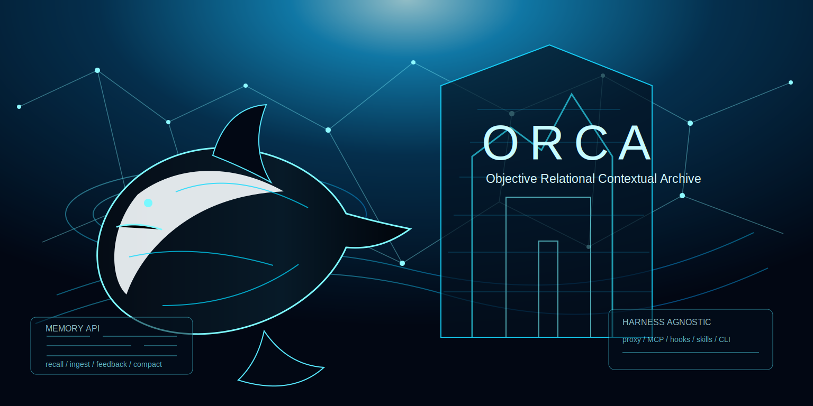

# ORCA

<p align="center">
  
</p>

<p align="center">
  <a href="https://nodejs.org/"></a>
  
  
  
  
  
  
  
</p>

**ORCA** stands for **Objective Relational Contextual Archive**. It is a local-first memory service for agentic coding systems and LLM applications. ORCA gives agents one durable memory contract: **recall before work, inject relevant context, ingest outcomes, compact sessions, and preserve useful knowledge across tools, prompts, sessions, projects, and teams**.

Most coding agents lose important context when a session ends, a tool call finishes, a model window rolls over, or a different harness takes over. ORCA solves that by running as an external memory sidecar with an HTTP API, an OpenAI-compatible proxy, MCP tools, lifecycle hooks, skills, CLI helpers, and harness-agnostic activation bundles. It is designed to be installed by the coding agent itself into Codex, Claude Code, Cursor, Gemini CLI, OpenCode, Aider, Goose, Cline, Roo Code, Continue, Windsurf, Antigravity, Pi, Factory Droid, custom harnesses, or any runtime that can read rules, call tools, run hooks, execute local commands, or route model traffic.

Under the hood, ORCA layers Redis for working memory, Weaviate for semantic recall, Neo4j for graph memory, and Temporal for background workflows. You interact with those systems through one API and one operational model instead of wiring each datastore, retrieval path, and maintenance job by hand.

## What ORCA Solves

- **Persistent agent memory**: keep project decisions, user preferences, tool outcomes, corrections, and unresolved follow-ups beyond a single chat window.
- **Harness portability**: install the same memory contract across different coding agents without depending on one vendor-specific plugin model.
- **Every-prompt enforcement**: use the OpenAI-compatible proxy or enforced middleware so recall and ingest happen around every model call.
- **Explicit memory tools**: expose `orca_recall`, `orca_remember`, `orca_compact`, `orca_feedback`, and `orca_list` through MCP-capable agents.
- **Operational visibility**: inspect health, metrics, workflows, memory artifacts, and graph relationships through the API, UI, Prometheus, and Grafana.
- **Deployment flexibility**: run locally with Compose, ship containers, or adapt the Kubernetes reference manifests for your own infrastructure.

## How You Use It

| Goal | Recommended path |
|------|------------------|
| Run ORCA locally for development | `pnpm install`, configure `.env`, then start Compose plus the API/worker |
| Smoke test the full app stack | `docker compose --profile app up -d --build` |
| Add ORCA to an agent harness | `pnpm orca:cli -- install universal --enforce --destination ./orca-agent-install` |
| Force memory on every model call | Run `pnpm orca:proxy` and set `OPENAI_BASE_URL=http://127.0.0.1:4030` |
| Add explicit memory tools | Install the generated `<target>.mcp.json` in any MCP-capable harness |
| Build your own runtime integration | Use `@orca/harness` or call the HTTP Memory API directly |

---

## Table of contents

- [What ORCA Solves](#what-orca-solves)
- [How You Use It](#how-you-use-it)
- [Overview](#overview)
- [Who this is for](#who-this-is-for)
- [What you get (and what you do not)](#what-you-get-and-what-you-do-not)
- [Quick start](#quick-start)
- [Authenticate your requests](#authenticate-your-requests)
- [Using the Memory API](#using-the-memory-api)
- [Plug-and-play agent integration](#plug-and-play-agent-integration)
- [Integrations appendix](#integrations-openai-langgraph-crewai-style)
- [Architecture](#architecture)
- [Ports](#ports-reference)
- [Onboarding tooling](#onboarding-tooling)
- [Build, package, deploy](#build-package-deploy)
- [Operational validation](#operational-validation)
- [Monitoring](#monitoring)
- [Backup / restore summary](#backup--restore-summary)
- [Security & hardening](#security--hardening)
- [Known limitations](#known-limitations)
- [Release maturity](#release-maturity)
- [Repository layout](#repository-layout)
- [Documentation](#documentation)
- [Contributing](#contributing)

---

## Overview

ORCA **ingests** experiences and conversation context, **routes** artifacts into the right substrates, **recalls** blended context across lexical, semantic, graph, and recency signals, and **runs workflows** that reindex, compact, and promote durable memory.

The runtime is intentionally **two services**: `memory-api` (online ingest/recall paths) and `worker` (async maintenance orchestrated via Temporal).

## Who this is for

ORCA is aimed at engineers who need:

- **Local-first development** — run the stack on one machine with Docker Compose plus two Node processes.
- **Integration testing** — hit stable HTTP endpoints while swapping embeddings and models behind the control plane.
- **Reference deployments** — use container images and Kubernetes manifests as templates, then harden them for your environment.

It is **not** a turnkey multi-tenant SaaS. Plan to supply identity, tenancy, quotas, backups, and production-grade infra around the manifests this repo publishes.

## What you get (and what you do not)

| You get | You do not get (today) |
|--------|-------------------------|
| HTTP Memory API (`/v1/memories/*`, metrics, workflows view) | A hosted SaaS UI or multitenant billing |
| Hybrid retrieval orchestration across Redis / Weaviate / Neo4j | Hosted MCP gateway or managed adapter distribution |
| Feedback-driven salience and adaptive compaction | A fully scripted production CD path tested on every fork |
| Docker Compose stacks, GHCR images, K8s reference manifests | Stateful services auto-provisioned in every `kubectl apply` snippet |
| Grafana / Prometheus configs and alerting examples | Opinionated SOC2-style compliance toolkit |

See [release maturity](#release-maturity) for where this realistically fits in your rollout.

---

## Quick start

Requirements: **Node.js 22+**, **pnpm**, **Docker Desktop** (or Compose-compatible engine).

### Option A — Fully containerized app stack (recommended for product smoke)

This path keeps the API, worker, data stores, and Qwen embedding runtime inside
Docker. It is the closest local version of the shippable application.

```bash
cp .env.production.example .env
# Set ORCA_API_KEY and replace any production placeholders before sharing the stack.
docker compose --profile app up -d --build
```

For local Compose runs, the bundled Neo4j image requires an 8+ character password. The development examples use `orca-memory`.

The first build downloads and caches the default quantized embedding model in
the app images:

```bash
EMBEDDING_PROVIDER=transformers
EMBEDDING_MODEL=onnx-community/Qwen3-Embedding-0.6B-ONNX
EMBEDDING_DTYPE=q8
EMBEDDING_DIMENSIONS=1024
```

Use `WARM_EMBEDDING_MODEL=false docker compose --profile app up -d --build`
for faster local rebuilds after the model path has already been verified.

### Option B — One-shot bootstrap

Requires only Node (no prior `pnpm install`):

```bash
node scripts/bootstrap.mjs init
```

This typically creates `.env` when missing, installs dependencies, lifts infrastructure, optionally starts app containers, verifies health endpoints, and can emit a harness bundle under `generated/harness/`.

### Option C — Manual host services

This path runs Redis, Weaviate, Neo4j, and Temporal in Docker, then runs the
Node API and worker on the host for faster edit/test cycles.

```bash
pnpm install
cp .env.example .env
# Set ORCA_API_KEY before starting APIs (see Authenticate your requests).
docker compose up -d

pnpm --filter @orca/memory-api dev      # Terminal 1
pnpm --filter @orca/worker dev           # Terminal 2
```

### Smoke health checks

```bash
curl http://127.0.0.1:4000/health
curl http://127.0.0.1:4010/health
```

Prefer a guided local console? Install deps, then:

```bash
pnpm orca:ui
```

Open [`http://127.0.0.1:4020`](http://127.0.0.1:4020). The console shows
bootstrap status, service health, module metrics, recent memories, harness
snippets, and an interactive memory graph with draggable artifact/tag/module
nodes.

For a mandatory memory sidecar in OpenAI-compatible harnesses, run:

```bash
export OPENAI_API_KEY=<your-provider-key>
export ORCA_PROXY_UPSTREAM_BASE_URL=https://api.openai.com
pnpm orca:proxy
```

Point the harness at `OPENAI_BASE_URL=http://127.0.0.1:4030`. The proxy recalls
Orca memory before every chat-completion call and persists the completed
turn after the model responds. The proxy handles OpenAI-compatible
`/v1/chat/completions` requests in both streaming and non-streaming modes.

---

## Authenticate your requests

Default `.env.example` pins `ORCA_AUTH_MODE=api-key`. Until `ORCA_API_KEY` is **non-empty**, every `/v1/*` and `/workflows/*` request is rejected (**health** routes stay open).

Recommended paths:

1. **Bootstrap** — `node scripts/bootstrap.mjs init` generates a random key when `.env` is blank.
2. **Manual secret** — set `ORCA_API_KEY=your-strong-secret`.
3. **Local-only experiments** — set `ORCA_AUTH_MODE=none` (**never expose this publicly**).

Callers authenticate with **`x-api-key: <ORCA_API_KEY>`** (or `Authorization: Bearer <same value>`).

JWT / hybrid modes (`ORCA_AUTH_MODE=jwt|hybrid`) require issuer/JWKS configuration—follow [`SECURITY.md`](SECURITY.md) patterns.

Examples below assume you exported your key:

```bash
export ORCA_API_KEY="$(grep '^ORCA_API_KEY=' .env | cut -d= -f2-)"
API_AUTH=(-H "content-type: application/json" -H "x-api-key: ${ORCA_API_KEY}")
```

If you flipped auth mode to `none`, drop the `-H x-api-key` lines.

---

## Using the Memory API

Base URL defaults to **`http://127.0.0.1:4000`** (`memory-api`). Worker HTTP defaults to **`http://127.0.0.1:4010`**.

### 1. Ingest memory

```bash
curl -X POST "${ORCA_BASE_URL:-http://127.0.0.1:4000}/v1/memories/ingest" \
  -H 'content-type: application/json' \
  -H "x-api-key: ${ORCA_API_KEY:?set ORCA_API_KEY from .env}" \
  -d '{
    "scope": "workspace",
    "source": "readme-example",
    "tags": ["memory-os", "demo"],
    "content": "The Retrieval Orchestrator uses Redis for working memory, Weaviate for semantic search, and Neo4j for graph reasoning."
  }'
```

Artifacts land in Redis, Weaviate, and Neo4j; background workflows enqueue as configured.

### 2. Recall context

```bash
curl -X POST "${ORCA_BASE_URL:-http://127.0.0.1:4000}/v1/memories/recall" \
  -H 'content-type: application/json' \
  -H "x-api-key: ${ORCA_API_KEY:?set ORCA_API_KEY from .env}" \
  -d '{
    "query": "What does the Retrieval Orchestrator use for working memory and graph reasoning?",
    "scope": "workspace",
    "includeDiagnostics": true
  }'
```

### 3. Apply feedback / salience

```bash
curl -X POST "${ORCA_BASE_URL:-http://127.0.0.1:4000}/v1/memories/feedback" \
  -H 'content-type: application/json' \
  -H "x-api-key: ${ORCA_API_KEY:?set ORCA_API_KEY from .env}" \
  -d '{
    "artifactId": "<paste-artifact-id>",
    "useful": true
  }'
```

### 4. Compact & promote conversation memory

```bash
curl -X POST "${ORCA_BASE_URL:-http://127.0.0.1:4000}/v1/memories/compact" \
  -H 'content-type: application/json' \
  -H "x-api-key: ${ORCA_API_KEY:?set ORCA_API_KEY from .env}" \
  -d '{
    "scope": "workspace",
    "occupancyRatio": 0.74,
    "sessionId": "demo-session",
    "messages": [
      { "role": "user", "content": "Redis runs on port 6380 locally." },
      { "role": "assistant", "content": "Check docker compose, restart worker, recall again." },
      { "role": "user", "content": "Follow up on auth rollout." }
    ]
  }'
```

### 5. Trigger maintenance workflows (worker API)

```bash
curl -X POST "${ORCA_WORKER_URL:-http://127.0.0.1:4010}/workflows/reindex" \
  -H 'content-type: application/json' \
  -H "x-api-key: ${ORCA_API_KEY:?set ORCA_API_KEY from .env}" \
  -d '{}'
```

Inspect runs:

```bash
curl "${ORCA_BASE_URL:-http://127.0.0.1:4000}/v1/workflows/runs"
curl "${ORCA_WORKER_URL:-http://127.0.0.1:4010}/workflows/definitions"
```

### 6. Metrics & dashboards

```bash
curl http://127.0.0.1:4000/v1/metrics/modules
curl http://127.0.0.1:4000/metrics
curl http://127.0.0.1:4010/metrics
```

Default local dashboards (when infra profile is enabled): Grafana [`127.0.0.1:3001`](http://127.0.0.1:3001), Prometheus [`127.0.0.1:9090`](http://127.0.0.1:9090), Alertmanager [`127.0.0.1:9093`](http://127.0.0.1:9093).

### Minimal route map

Memory API highlights:

| Method | Path | Purpose |
|--------|------|---------|
| `GET` | `/health` | Liveness probe |
| `GET` | `/v1/memories` | Inspect stored summaries |
| `GET` | `/v1/memories/export` | Export stored memory artifacts, optionally by scope |
| `PATCH` | `/v1/memories/:id` | Edit memory content, summary, tags, salience, confidence, metadata |
| `DELETE` | `/v1/memories/:id` | Delete one memory artifact and linked chunks |
| `DELETE` | `/v1/memories?scope=<scope>` | Wipe all artifacts in a scope |
| `POST` | `/v1/memories/ingest` | Create memory artifacts |
| `POST` | `/v1/memories/recall` | Hybrid retrieval |
| `POST` | `/v1/memories/feedback` | Reward / attenuate artifacts |
| `POST` | `/v1/memories/compact` | Adaptive compaction workflow |
| `GET` | `/v1/workflows/runs` | Workflow visibility |
| `GET` | `/v1/metrics/modules` | JSON module telemetry |
| `GET` | `/metrics` | Prometheus scrape surface |

Worker highlights:

| Method | Path | Purpose |
|--------|------|---------|
| `GET` | `/health` | Worker probe |
| `POST` | `/workflows/reindex` | Kick async reindex |
| `POST` | `/workflows/execute` | Generic workflow enqueue |
| `GET` | `/workflows/definitions` | Enumerate workflow definitions |
| `GET` | `/workflows/runs` | Inspect run history |

---

## Integrations (OpenAI, LangGraph, CrewAI-style)

Orca is transport-agnostic HTTP. For **recall → augment prompt → respond → ingest** wiring with popular agent stacks, copy the patterns in [**`docs/integration/harness-integrations.md`**](docs/integration/harness-integrations.md) (minimal `fetch` helpers, an OpenAI Chat Completions example using `openai` on npm, LangGraph-style graph notes, and Crew-style tool hooks).

The in-repo MCP adapter under [`integrations/mcp-server`](integrations/mcp-server) reads `ORCA_BASE_URL` and `ORCA_API_KEY`; use it as a local bridge for Codex, Claude Code, Cursor, Gemini CLI, OpenCode, Antigravity, Pi, Factory Droid, and custom harnesses that support MCP. Supported scopes are `session`, `agent`, `user`, `user-profile`, `workspace`, `global`, `project:<id>`, `skill:<id>`, and `session:<id>`.

## Plug-and-play agent integration

ORCA is intended to distribute as a local memory sidecar that a coding agent can
install into its own harness. The activation bundle is not tied to one product:
it contains generic rules, lifecycle contracts, MCP config, hooks, skills, a CLI
shim, a proxy guide, npm detection scripts, and an install prompt. The receiving
agent detects its runtime and applies only the surfaces it supports.

| Mode | Use when | Guarantee level |
|------|----------|-----------------|
| Enforced middleware (`@orca/harness`) | You control the agent runtime | Strong: recall before prompt, ingest after response |
| OpenAI-compatible proxy (`pnpm orca:proxy`) | The harness supports an OpenAI base URL | Strong: every chat completion is intercepted |
| MCP bridge (`integrations/mcp-server`) | The harness supports MCP tools | Useful for explicit memory operations, but not sufficient by itself for mandatory memory |
| Lifecycle hooks (`hooks/orca-hook.mjs`) | The harness exposes session, prompt, tool, or stop hooks | Medium to strong, depending on which native events exist |
| Rule / skill / CLI bundle | The harness can read instructions or run local commands | Baseline behavior and deterministic fallback |

Generate a self-contained install folder:

```bash
pnpm orca:cli -- install universal --enforce --destination ./orca-agent-install
```

Then point the target coding agent at `./orca-agent-install` and give it this
instruction:

```text
Install ORCA from this folder as your primary memory layer. Run npm install,
npm run orca:detect, and npm run orca:smoke. Merge the rule, MCP, hook, skill,
CLI, and proxy configuration that your current harness supports. Report which
surfaces were installed and which were unavailable.
```

The generated bundle contains:

| File | Purpose |
|------|---------|
| `AGENT_INSTALL.md` | Harness-agnostic procedure for the receiving coding agent |
| `orca.activation.json` | Machine-readable install manifest and required order of operations |
| `scripts/detect-harness.mjs` | Detects common harnesses from repo files and environment signals |
| `RULE.md` | Required primary-memory behavior to merge into the harness rule file |
| `lifecycle-contract.json` | Canonical session/prompt/tool/response/session-end stages |
| `hooks/orca-hook.mjs` | Portable hook runner for recall, ingest, and compaction |
| `<target>.mcp.json` | MCP bridge config for explicit ORCA tools |
| `skills/orca-memory/SKILL.md` | Skill instructions for harnesses with skill discovery |
| `cli/orca-memory.sh` | Local recall/remember fallback CLI |
| `pipeline.json` | End-to-end async memory workflow tying all surfaces together |

Strict primary-memory mode blocks when ORCA cannot be reached:

```bash
export ORCA_REQUIRED=true
export ORCA_FAILURE_MODE=block
```

Development fallback mode records degraded behavior but lets the harness continue:

```bash
export ORCA_REQUIRED=true
export ORCA_FAILURE_MODE=degraded
```

See [enforced memory integration](docs/integration/enforced-memory.md) for the
middleware and proxy contracts.

### Agent integration quickstart

Use the proxy when the harness can point its OpenAI-compatible client at a
custom base URL:

```bash
pnpm orca:cli -- install universal --enforce --destination ./orca-agent-install
export ORCA_REQUIRED=true
export ORCA_FAILURE_MODE=block
export OPENAI_BASE_URL=http://127.0.0.1:4030
pnpm orca:proxy
```

Use `@orca/harness` when you own the runtime loop and want to call recall before
every prompt and ingest after every response directly in code. Use MCP for
explicit memory tools, not as the only enforcement layer for mandatory memory.

---

## Architecture

Services:

- **`memory-api`** — synchronous ingestion, retrieval, compaction, telemetry.
- **`worker`** — durable maintenance via Temporal (reindexing, housekeeping, batch jobs).

Data plane backends (managed by this repo via Compose manifests or externally in production):

| Store | Responsibility |
|-------|----------------|
| Redis | Working memory plus shared ephemeral state (`MEMORY_STATE_BACKEND=redis` recommended in containers). |
| Weaviate | Embeddings / semantic retrieval. |
| Neo4j | Temporal graph reasoning for entities & relations. |

Operational packaging includes Prometheus scraping, Grafana dashboards, Docker Compose presets, Kubernetes references, Alertmanager stubs, plus GitHub Actions for CI, image pushes, staged deploy pipelines.


Editable SVG source — [`docs/assets/architecture-reference.svg`](https://github.com/EddiksonPena/Orca/blob/main/docs/assets/architecture-reference.svg).

Deeper dives: [**System overview**](docs/architecture/system-overview.md) explains flows, compaction heuristics, and subsystem boundaries beyond this diagram.

---

## Ports reference

| Service | Port |
|---------|------|
| Memory API | `4000` |
| Worker | `4010` |
| Onboarding UI (`pnpm orca:ui`) | `4020` |
| OpenAI-compatible memory proxy | `4030` |
| Redis | `6380` (purposefully off `6379` to dodge host clashes) |
| Weaviate | `8080` |
| Neo4j Browser / Bolt | `7474` / `7687` |
| Temporal Frontend | `7233` |
| Grafana | `3001` |
| Prometheus | `9090` |
| Alertmanager | `9093` |

Local file-backed snapshots default to `./data` when `.env` uses `MEMORY_STATE_BACKEND=file`; container workloads should prefer Redis-backed coordination.

---

## Onboarding tooling

| Command | When to run |
|---------|--------------|
| `node scripts/bootstrap.mjs doctor` | Pre-flight prerequisites before sharing with teammates. |
| `node scripts/bootstrap.mjs init` | First-time workstation setup plus optional stack orchestration. |
| `node scripts/bootstrap.mjs connect` | Echo harness snippets for external agent stacks. |
| `node scripts/bootstrap.mjs down` | Tear down compose profiles started by onboarding. |
| `pnpm orca:ui` | Launch the local memory console with health checks, harness snippets, and graph visibility. |
| `pnpm orca:proxy` | Launch the OpenAI-compatible proxy that enforces recall/ingest around every chat completion. |
| `pnpm orca:cli -- install universal --enforce --destination ./orca-agent-install` | Generate a self-contained, harness-agnostic activation bundle that a coding agent can install from the destination folder. |
| `pnpm orca:cli -- export --scope workspace` | Export memories from a running Orca service. |
| `pnpm orca:cli -- import --file generated/export.json` | Re-ingest exported memory artifacts. |
| `pnpm orca:cli -- wipe --scope project:demo` | Delete all memories in a scope. |

Harness payloads land in [`generated/harness/`](generated/harness/) by default, or in the folder passed to `--destination`. For agent self-install, point the coding agent at that destination folder and ask it to run `npm install`, `npm run orca:detect`, then follow `AGENT_INSTALL.md`. Targeted installs include:

- `AGENT_INSTALL.md` — harness-agnostic instructions for a coding agent to detect its runtime and install the supported surfaces.
- `INSTALL_PROMPT.md` — paste into the target agent to install/merge the bundle.
- `package.json`, `scripts/detect-harness.mjs`, and `scripts/smoke-install.mjs` — npm-compatible setup, harness detection, and bundle smoke checks.
- `RULE.md` — primary-memory rule text for AGENTS.md, CLAUDE.md, cursor rules, opencode rules, or project rule.md.
- `lifecycle-contract.json`, `hooks.abstract.json`, and `hooks/orca-hook.mjs` — harness-neutral lifecycle wiring for session start, pre-prompt, pre-tool, post-tool, post-response, and session-end style events where supported.
- `ADAPTER_NOTES.md` — target-specific guidance for Codex, Claude Code, Cursor, Gemini CLI, OpenCode, Antigravity, Pi, Factory Droid, or unknown/custom harnesses.
- `skills/orca-memory/SKILL.md` — skill instructions for harnesses that support skill discovery.
- `<target>.mcp.json` — MCP server config for Orca memory tools.
- `cli/orca-memory.sh` — simple recall/remember CLI shim.
- `pipeline.json` — asynchronous memory workflow manifest tying rules, hooks, skills, MCP, CLI, and proxy together.

---

## Build, package, deploy

### Containers

```bash
docker build -f apps/memory-api/Dockerfile -t orca/memory-api:local .
docker build -f apps/worker/Dockerfile -t orca/worker:local .
docker build -f apps/proxy/Dockerfile -t orca/proxy:local .
```

For registry publishing, tag the three runtime images with your owner and
release version:

```bash
docker build -f apps/memory-api/Dockerfile -t ghcr.io/<owner>/orca-memory-api:<tag> .
docker build -f apps/worker/Dockerfile -t ghcr.io/<owner>/orca-worker:<tag> .
docker build -f apps/proxy/Dockerfile -t ghcr.io/<owner>/orca-proxy:<tag> .

docker push ghcr.io/<owner>/orca-memory-api:<tag>
docker push ghcr.io/<owner>/orca-worker:<tag>
docker push ghcr.io/<owner>/orca-proxy:<tag>
```

### Compose “app profile”

```bash
cp .env.production.example .env   # Customize secrets before trusting this path
docker compose --profile app up -d --build
```

By default, the Compose app profile builds the Memory API and worker images with
`WARM_EMBEDDING_MODEL=true`, which downloads and caches the quantized Qwen
embedding model declared by:

```bash
EMBEDDING_PROVIDER=transformers
EMBEDDING_MODEL=onnx-community/Qwen3-Embedding-0.6B-ONNX
EMBEDDING_DTYPE=q8
EMBEDDING_DIMENSIONS=1024
```

Set `WARM_EMBEDDING_MODEL=false` for faster local image rebuilds, or set
`EMBEDDING_PROVIDER=hash` for deterministic offline smoke tests.

CI publishes immutable tags via [`.github/workflows/release-images.yml`](.github/workflows/release-images.yml).

### Simple VPS deployment

1. Build or pull the three runtime images: memory API, worker, and proxy.
2. Copy `.env.production.example` to `.env` and set real values for `ORCA_API_KEY`, `NEO4J_PASSWORD`, and upstream provider keys.
3. Run `docker compose --profile app up -d`.
4. Put the Memory API and/or proxy behind TLS.
5. Keep Redis, Weaviate, Neo4j, Temporal, and Postgres ports private.
6. Run `pnpm orca:smoke` and `pnpm orca:load -- --requests 60 --concurrency 6` against the deployed endpoints.

### Kubernetes

Reference manifests live under [`deploy/k8s/`](deploy/k8s/) (ConfigMaps, workloads, PDBs, HPA hooks, Ingress examples).

**Bare reference** — applies only Orca workloads; operators must attach managed Redis / Weaviate / Neo4j / Temporal / Postgres externally.

```bash
kubectl apply -f deploy/k8s/namespace.yaml
kubectl apply -f deploy/k8s/configmap.yaml
kubectl apply -f deploy/k8s/secret.example.yaml
kubectl apply -f deploy/k8s/memory-api-deployment.yaml
kubectl apply -f deploy/k8s/worker-deployment.yaml
```

**Stacked demo** (`deploy/k8s/platform`) folds in Compose-adjacent data dependencies for evaluation clusters—still **reference-grade**, not a compliance-ready production bundle.

Staging / production rollout guidance: [**Production readiness playbook**](docs/deployment/production-readiness.md), [**Backup & restore**](docs/deployment/backup-and-restore.md), **[Distributed deployment considerations](docs/deployment/distributed-open-source-deployment.md)**.

GitHub workflows for reference environments: **[`deploy-reference.yml`](.github/workflows/deploy-reference.yml)**, **[`promote-release.yml`](.github/workflows/promote-release.yml)** — enable environment protection gates on GitHub Environment names before trusting automated promotion logic.

---

## Operational validation

```bash
pnpm orca:preflight -- --env-file .env.production.example
pnpm orca:smoke
pnpm orca:load -- --requests 60 --concurrency 6
pnpm orca:sandbox-smoke
```

These wrap [`scripts/production-readiness.mjs`](scripts/production-readiness.mjs)—pair them with staged smoke tests hitting every dependency tier. The smoke script defaults to a longer timeout for cold local Transformers/Qwen initialization; override with `ORCA_SMOKE_TIMEOUT_MS` or `--timeout-ms`.

`pnpm orca:sandbox-smoke` runs an isolated local smoke without Docker:
temporary data directory, random localhost ports, hash embeddings, local workflow
execution, and a mock OpenAI-compatible upstream for proxy verification.

For a containerized smoke that keeps app state in disposable Docker volumes, use
a throwaway Compose project name:

```bash
docker compose -p orca-smoke --profile app down -v --remove-orphans

ORCA_API_KEY=smoke-docker-key \
ORCA_AUTH_MODE=api-key \
APP_NEO4J_PASSWORD=orca-memory \
EMBEDDING_PROVIDER=hash \
EMBEDDING_DIMENSIONS=32 \
WARM_EMBEDDING_MODEL=false \
TEMPORAL_EXECUTION_MODE=local \
docker compose -p orca-smoke --profile app up -d --build

ORCA_API_KEY=smoke-docker-key \
node scripts/production-readiness.mjs smoke \
  --base-url http://127.0.0.1:4000 \
  --worker-url http://127.0.0.1:4010 \
  --scope project:docker-orca-smoke

ORCA_API_KEY=smoke-docker-key \
node scripts/production-readiness.mjs load \
  --base-url http://127.0.0.1:4000 \
  --scope workspace \
  --requests 60 \
  --concurrency 6

docker compose -p orca-smoke --profile app down -v --remove-orphans
```

---

## Monitoring

- Memory API publishes JSON summaries at **`GET /v1/metrics/modules`** and Prometheus text at **`GET /metrics`**.
- Worker publishes the same split at **`GET /metrics/modules`** and **`GET /metrics`**.
- Example **`ServiceMonitor`**, **`PrometheusRule`**, and **`AlertmanagerConfig`** resources live beside the Kubernetes manifests; tune receivers before applying to live clusters.

## Backup / restore summary

| Component | Minimum backup expectation |
|-----------|----------------------------|
| Redis | RDB/AOF snapshot or managed Redis backup. |
| Weaviate | Persistent volume snapshot or managed backup/export. |
| Neo4j | `neo4j-admin database dump` or managed graph database snapshot. |
| Temporal/Postgres | Postgres dump or volume snapshot for Temporal state. |

Run a restore drill before relying on Orca for durable production memory.

---

## Security & hardening

What already exists:

- Configurable **`ORCA_AUTH_MODE`**: `api-key`, `jwt`, `hybrid`, `none`.
- Payload guardrails (`MAX_REQUEST_BYTES`).
- Cooperative shutdown honoring `SIGTERM`/`SIGINT`.
- Optional Redis-backed state for clustered pods.

Mandatory before trusting this on hostile networks:

- TLS termination at ingress
- Dedicated secret vaulting (avoid committing real secrets—even “example” overlays should rotate)
- Network policies narrowed to Temporal + datastore subnets
- Backups + restores validated per datastore (see **[backup playbook](docs/deployment/backup-and-restore.md)**)

Responsible disclosure guidelines live in **`SECURITY.md`**.

## Known limitations

- Orca does not ship or host a default chat/completion model; the proxy forwards to the upstream provider you configure.
- MCP tools are useful for explicit memory operations, but mandatory every-prompt memory requires the proxy or enforced middleware.
- Production deployments still need external identity policy, TLS, secret rotation, datastore backups, and network hardening.
- The Kubernetes and Compose manifests are reference deployments; tune storage classes, resource limits, and ingress policy for your environment.

---

## Release maturity

| Stage | Suitability |
|-------|--------------|
| **Local / OSS evaluation** | **Ready** — Compose + docs + onboarding UI keep spin-up repeatable. CI enforces lint/build/typecheck/tests. GHCR publishes tags. |
| **Staging clusters** | **Partial** — You must bolt on managed infra, ingress, rotated secrets, and smoke automation. Harness integration now supports enforced middleware, an OpenAI-compatible proxy, and the MCP bridge. |
| **Highly regulated enterprise production** | **Not endorsed yet** — You still need hardened dependency bundles, audited authorization semantics, repeatable CD plus rollback rehearsal, and field-tested ops runbooks. Finish those externally before staking production SLAs on this distribution. |

Use this framing in internal reviews and stakeholder updates so expectations stay grounded.

---

## Repository layout

| Path | Role |
|------|------|
| `apps/memory-api` | Production HTTP façade |
| `apps/worker` | Temporal-connected worker daemon |
| `packages/core` | Routing, ingestion, retrieval, lifecycle, adapters |
| `packages/harness` | Enforced memory middleware for agent runtimes and proxy integrations |
| `packages/config`, `packages/schemas`, `packages/auth`, `packages/onboarding` | Contracts + utilities |
| `infra/docker`, `deploy/k8s` | Runtime wiring & cluster templates |
| `docs/` | Narrative docs, roadmap, alignment notes |
| `scripts/` | Bootstrap + operational CLIs |

---

## Documentation

- [**Harness integrations (OpenAI / LangGraph-style / CrewAI-style)**](docs/integration/harness-integrations.md)
- [**Enforced memory integration**](docs/integration/enforced-memory.md)
- [**Setup & day-two usage**](docs/setup/setup-and-usage.md)
- [**System overview & heuristics**](docs/architecture/system-overview.md)
- [**Production readiness checklist**](docs/deployment/production-readiness.md)
- [**Distributed deployment nuances**](docs/deployment/distributed-open-source-deployment.md)
- [**Kubernetes reference README**](deploy/k8s/README.md)
- [**Source alignment stance**](docs/reference/source-alignment.md)
- [**MVP roadmap**](docs/roadmap/mvp-roadmap.md)
- [**ADR 001 · Control-plane boundaries**](docs/adr/001-control-plane-boundaries.md)

Optional advanced topic — **Python Graphiti bridge**:

- Set `TEMPORAL_GRAPH_BACKEND=graphiti-python`.
- Provision `GRAPHITI_PYTHON_BIN` plus Graphiti's Ollama-backed model env vars
  (`OLLAMA_HOST`, `EXTRACTION_MODEL`, `GRAPHITI_EMBEDDING_MODEL`, etc.).
- Pin `GRAPHITI_GROUP_ID` for namespace isolation.

---

## Contributing

Please read **[`CONTRIBUTING.md`](CONTRIBUTING.md)** and **`CODE_OF_CONDUCT.md`** before submitting issues or patches.

---

MIT License · see **`LICENSE`** for full text.
