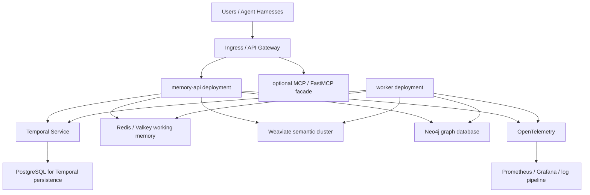

# Distributed Open Source Deployment Guide

## Goal

Turn `Orca` from a strong local-first prototype into a robust distributed open source project that can be operated by a small team and adopted by the community.

## Executive Recommendation

Use three deployment profiles:

1. `Local Development`
   Docker Compose, single-node everything, no external ingress.

2. `Staging`
   Kubernetes or Nomad, production-like topology, but with reduced redundancy and smaller data footprints.

3. `Production`
   Stateless app services, durable workflow infrastructure, persistent data services, TLS ingress, centralized observability, backups, and controlled rollouts.

## Recommended Production Topology

## Recommended Component Roles

### memory-api

- stateless
- horizontally scalable
- front-door HTTP API
- authentication, request validation, routing, packaging

### worker

- stateless
- horizontally scalable
- consumes workflow tasks
- runs reindex, dedupe, lifecycle, evaluation, and repair jobs

### Temporal

- workflow durability
- retries
- scheduling
- cross-service orchestration

### Redis

- short-lived working memory
- recent context pointers
- optional hot-path cache

### Weaviate

- semantic and hybrid retrieval
- vector-backed candidate generation

### Neo4j

- temporal entity and relationship memory
- provenance-aware graph traversal

## Deployment Strategy By Dependency

### FastAPI

FastAPI is a strong option for a future Python API facade. FastAPI’s deployment docs emphasize core deployment concepts first, then containerization and worker replication.

Recommendation:

- if you introduce a Python facade, package it as a container
- run behind an ingress or reverse proxy
- keep app containers stateless
- scale API replicas independently from workers

### FastMCP

FastMCP is best treated as an optional MCP-facing facade, not the core control plane runtime for this repo.

Recommendation:

- keep the control plane as a service-first API
- add a Python `FastMCP` package later as a thin MCP adapter
- use `fastmcp.json` for reproducible MCP deployment configuration if you add this facade

### Temporal

Temporal is the right backbone for reindex, lifecycle, evaluation, and replayable maintenance work.

Recommendation:

- local: use Docker Compose
- production: use Temporal Cloud or self-host with durable persistence
- do not embed workflow durability in your API app
- store Temporal persistence in a dedicated SQL backend

If you want the most robust operations story quickly, `Temporal Cloud` is operationally simpler than self-hosting. If strict OSS self-hosting is the goal, run Temporal separately and treat it as platform infrastructure.

### Redis / LangCache

Important constraint:

- `Redis LangCache` is currently documented as a managed service on Redis Cloud, not a fully local open source drop-in

That means:

- if you want strict local-first OSS, use plain `Redis` for working memory and build your own semantic cache layer
- if you accept managed cloud services, LangCache can be added later as an optimization for semantic response caching

Recommendation:

- use `Redis` or `Valkey` for OSS-first working memory
- add a semantic cache interface in your app
- plug LangCache in as an optional managed acceleration path, not a hard dependency

### Graphiti

Graphiti is a strong fit conceptually because it is explicitly designed for temporally-aware knowledge graphs for agents and is built around Neo4j-backed temporal context graphs and hybrid retrieval.

Recommendation:

- treat Graphiti as a future Python-side integration or reference implementation
- keep your canonical contracts store-agnostic
- if you adopt it, isolate it behind a graph adapter boundary

### Neo4j

Critical production nuance:

- `Neo4j Community Edition` is suitable for single-instance deployments
- clustering and failover are `Enterprise Edition` features

That creates a real architecture fork:

1. `Strict OSS profile`
   Use Neo4j Community as a single-instance graph dependency with backups and clear blast-radius limits.

2. `Robust distributed Neo4j profile`
   Use Neo4j Enterprise or Aura for clustering, failover, and scale.

If your project must remain strictly open source and highly distributed, you should keep the graph interface pluggable and consider adding an OSS-distributed graph backend option later.

### Weaviate

Weaviate’s docs are clear:

- Docker is a strong choice for local evaluation and development
- Kubernetes is the natural path for development-to-production self-hosting

Recommendation:

- local: Docker Compose
- production: Kubernetes with persistence, auth, and replication settings
- enable auth and RBAC outside local dev

## Best Deployment Process

## Phase 1: Stabilize The Repo

- finalize public API contracts
- add request validation and typed errors
- add proper config layering
- separate app runtime code from dev-only execution paths

## Phase 2: Containerize Cleanly

- add production `Dockerfile`s for API and worker
- pin runtime versions
- add `.dockerignore`
- make the app boot from compiled artifacts or a production launcher

## Phase 3: Add CI

- format, lint, typecheck, test
- build images on every PR
- run compose-based smoke tests in CI
- publish SBOMs and image metadata

## Phase 4: Add CD

- deploy to staging automatically from `main`
- promote to production through tagged releases
- use immutable image tags
- keep rollbacks simple and documented

## Phase 5: Add Observability And SRE Basics

- trace ingest and recall flows
- export latency, failure, and queue metrics
- add dashboards for:
  - API latency
  - recall latency
  - Temporal task failures
  - Redis hit rates
  - Weaviate query health
  - Neo4j query health

## Phase 6: Add Multi-Node Production Support

- replicate stateless app layers
- externalize Temporal persistence
- harden Weaviate storage and auth
- choose an explicit Neo4j availability strategy
- document backup and restore for every dependency

## Suggested Open Source Distribution Model

### Repo Deliverables

- `docker-compose.yml` for local dev
- `docker compose --profile app` for application-layer container runs
- `helm/` or `deploy/k8s/` for production-like deployment
- `examples/` for single-agent and multi-agent usage
- `docs/` with setup, deployment, API, and troubleshooting
- versioned release notes
- CI and image-release workflows in `.github/workflows/`

### Release Tracks

- `community`: local-first, single-instance graph profile
- `production-reference`: staged Kubernetes manifests and operational guidance
- `enterprise-optional`: documented switches for managed dependencies or licensed clustering

## Security Checklist

- require auth in front of the public API
- disable anonymous Weaviate access outside local dev
- use TLS at ingress
- isolate secrets in a secret manager
- restrict Neo4j and Redis to private network access
- log access and admin events
- add backup encryption and retention policy

## What I Would Deploy Today

If I were turning this into a serious open source project now, I would choose:

### Community Open Source Distribution

- current `TypeScript` API service in containers
- worker service in containers
- `Temporal` self-hosted or cloud-backed
- `.env.production.example` copied into a deployment-specific secret store or env management system
- `docker compose --profile app up -d --build` for a single-node reference deployment

## Practical Launch Sequence

1. Copy `.env.production.example` into your environment management system and replace secrets.
2. Build and publish the two app images:
   - `orca-memory-api`
   - `orca-worker`
3. Stand up stateful dependencies:
   - `Redis`
   - `Weaviate`
   - `Neo4j`
   - `Temporal`
   - `PostgreSQL` for Temporal
4. Deploy stateless app services with:
   - Docker Compose profile `app`, or
   - Kubernetes manifests under `deploy/k8s`
5. Verify:
   - `/health`
   - `/v1/metrics/modules`
   - `/metrics`
   - Prometheus rules and Alertmanager readiness
6. Turn on `ORCA_API_KEY` before exposing routes beyond trusted local networks.
- `Redis` on `6380` locally, dedicated HA Redis or Valkey in production
- `Weaviate` on Kubernetes for production
- `Neo4j Community` for local, staging, and small-team production pilots

### Robust Production Distribution

- same app layer
- optional `FastAPI` or `FastMCP` facades only if you need Python-native or MCP-native ingress
- `Temporal Cloud` or hardened self-hosted Temporal
- dedicated Redis HA deployment
- Weaviate Kubernetes deployment with auth enabled
- Neo4j Enterprise or Aura for true clustered graph availability

That split is the most honest way to preserve the project’s open source identity while still giving teams a credible path to production.
