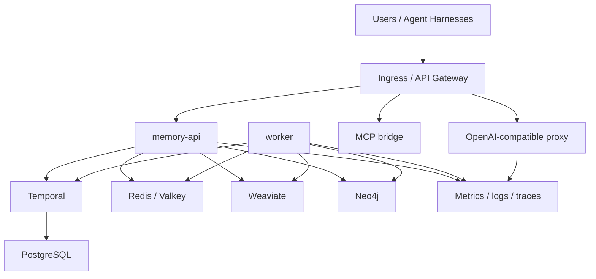

# Distributed Deployment Guide

This guide describes how to operate ORCA beyond a single-machine Compose setup.
It focuses on the runtime topology, dependency boundaries, and operational
controls required for a self-hosted deployment.

## Deployment Profiles

| Profile | Use case | Runtime shape |
|---------|----------|---------------|
| Local | Workstation evaluation and single-user operation | Docker Compose with bundled dependencies |
| Staging | Production-like validation before release | Kubernetes or equivalent scheduler with isolated data stores |
| Production | Shared memory service for teams or agent fleets | Replicated app services, durable managed or self-hosted dependencies, TLS ingress, backups, monitoring |

## Recommended Topology

## Component Responsibilities

| Component | Responsibility |
|-----------|----------------|
| `memory-api` | Authenticated ingest, recall, feedback, compaction, metrics, and workflow visibility |
| `worker` | Background reindexing, lifecycle maintenance, compaction, and workflow execution |
| `proxy` | OpenAI-compatible recall/ingest enforcement around chat-completion requests |
| Redis / Valkey | Working memory and shared runtime state |
| Weaviate | Semantic and hybrid retrieval |
| Neo4j | Graph memory, entity relationships, and temporal links |
| Temporal + PostgreSQL | Durable workflow orchestration |

## Production Requirements

- Put `memory-api` and `proxy` behind TLS.
- Keep Redis, Weaviate, Neo4j, Temporal, and PostgreSQL on private networks.
- Set `ORCA_AUTH_MODE=api-key`, `jwt`, or `hybrid`; do not expose `ORCA_AUTH_MODE=none`.
- Store `ORCA_API_KEY`, provider keys, and database credentials in a secret manager.
- Use persistent volumes or managed services for Redis, Weaviate, Neo4j, and PostgreSQL.
- Configure backups before relying on ORCA for durable memory.
- Scrape `/metrics` from `memory-api`, `worker`, and `proxy`.
- Run `pnpm orca:preflight` before rollout and `pnpm orca:verify` after rollout.

## Dependency Guidance

| Dependency | Guidance |
|------------|----------|
| Redis / Valkey | Use managed Redis/Valkey or a persistent self-hosted deployment with snapshot/AOF backups. |
| Weaviate | Use persistent storage, authentication, and replica settings appropriate for your workload. |
| Neo4j | Community Edition is suitable for single-instance deployments; use Enterprise/Aura or keep the graph adapter swappable if you need clustering. |
| Temporal | Use Temporal Cloud or self-host Temporal with durable PostgreSQL persistence. |
| PostgreSQL | Treat Temporal PostgreSQL as a critical workflow-durability dependency. |

## Rollout Sequence

1. Build or pull versioned images for `memory-api`, `worker`, and `proxy`.
2. Apply configuration and secrets.
3. Deploy private data services or connect managed services.
4. Deploy `memory-api`, `worker`, and optional `proxy`.
5. Expose only the public API/proxy ingress.
6. Run `pnpm orca:preflight -- --env-file <env-file>`.
7. Run `pnpm orca:verify` against the deployed endpoints.
8. Confirm metrics, dashboards, backups, and restore procedures.

## Security Checklist

- TLS is enabled at ingress.
- API auth is enabled.
- Provider keys are not stored in repository files.
- Datastore ports are not public.
- Backups are encrypted and tested.
- Metrics and logs do not expose prompt content or secrets.
- Production deployments use rotated secrets and least-privilege network access.
